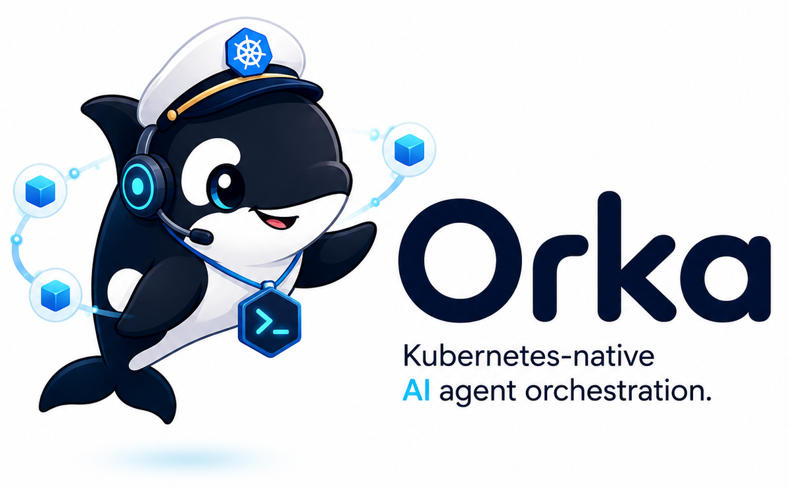

<div align="center">



# Orka

**Kubernetes-native AI agent orchestration.**

[Getting Started](docs/getting-started.md) · [Architecture](docs/architecture.md) · [API Reference](docs/api-reference.md) · [Documentation](#documentation)

</div>

---

Orka turns your Kubernetes cluster into an AI-powered task execution platform. Spin up swarms of AI agents that write code, review PRs, research topics, or run containers — each as an isolated Kubernetes Job with full scheduling, retries, and observability. A coordinator agent dynamically decomposes complex tasks, spawns specialist agents to work in parallel, and synthesizes their results — no manual orchestration graphs required.

One `helm install`, one LLM secret, and you're chatting with an orchestrator that handles the rest.

## Why Run AI Agents on Kubernetes?

**No API keys on developer machines** — LLM credentials live in Kubernetes Secrets, managed by your platform team. Developers connect via ServiceAccount tokens — no risk of leaked keys in dotfiles, shell history, or laptops.

**Centralized control** — One place to set model policies, rate limits, and allowed providers across every team. Swap models or providers without touching developer configs.

**Every agent action is auditable** — Tasks run as Kubernetes Jobs with full logs, Prometheus metrics, and result storage. Know exactly what every agent did, when, and at what cost.

**Isolated execution** — Each agent runs in its own Pod with a hardened security context: non-root, read-only rootfs, all capabilities dropped, seccomp enforced. Agents can't escape their sandbox.

**Scale with your cluster** — Priority scheduling, retry policies, concurrency limits, and cron-based execution — all handled by the Kubernetes control plane you already operate.

## What Can You Build?

**Parallel code review** — Spawn a swarm of review agents — security, performance, test coverage, accessibility, whatever you need. Each reviews independently and in parallel, then the coordinator synthesizes findings into a single report.

**Autonomous dev workflows** — A coordinator agent dynamically breaks down a feature request, delegates implementation to specialist agents (backend, frontend, tests), and opens a PR with the combined result — no predefined workflow graphs.

**Research with competing hypotheses** — Multiple agents investigate different theories in parallel, challenge each other's findings, and converge on the strongest explanation. The adversarial structure avoids the anchoring bias of sequential investigation.

**Scheduled operations** — Cron-based agents that run daily security scans, dependency audits, or report generation — all with retry policies and webhook notifications.

**Use your favorite AI client** — Connect Continue, Cursor, or any OpenAI-compatible client to Orka's API. Your cluster manages the LLM credentials — developers just code.

**CI/CD integration** — Trigger agent tasks from GitHub Actions, monitor progress via the REST API, and gate deployments on agent analysis.

## Features

- 🤖 **AI Agents** — Anthropic, OpenAI, or Azure OpenAI with tools, skills, and session persistence
- 🛠️ **Agent Runtimes** — Delegate to Codex CLI, Claude Code CLI, or GitHub Copilot CLI for full autonomous coding
- 🔀 **Multi-Agent Coordination** — Coordinators delegate to specialists with depth and concurrency controls
- 💬 **Interactive Chat** — Agentic orchestrator with SSE streaming that creates and manages agents and tasks for you
- 🧠 **Durable Memory** — Namespace-scoped recall, transcript search, and reviewable memory proposals for coordinated agents
- 🛡️ **Repository Security Scanning** — Scheduled and incremental repository scans with threat models, validated findings, patch generation, and remediation PRs
- 🖥️ **Web Dashboard** — Built-in React UI embedded in the controller binary — zero extra deployments
- 📦 **Declarative CRDs** — Task, Agent, Tool, Provider, and Skill custom resources for GitOps workflows
- ⏰ **Scheduled Tasks** — Cron-based recurring execution with concurrency policies
- 🔌 **REST & OpenAI-Compatible API** — Full CRUD + `/openai/v1/chat/completions` endpoint for Continue, Cursor, and any OpenAI-compatible client
- 🔐 **Kubernetes, OIDC & Context-Token API Auth** — ServiceAccount bearer tokens by default, optional OIDC JWT and `kontxt` TxToken validation for external callers, and verified requester stamping on Tasks
- 🔮 **Anthropic-Compatible API** — `/anthropic/v1/messages` endpoint for Claude Code and other Anthropic-native clients
- 📊 **Observability** — Prometheus metrics, structured logging, health probes
- 🔒 **Hardened by Default** — Non-root containers, read-only rootfs, ServiceAccount token auth

## Quick Start

### Install

```bash
helm install orka charts/orka \
  --namespace orka-system \
  --create-namespace
```

### Set Up a Provider

```bash
kubectl create secret generic anthropic-secret \
  --from-literal=api-key=your-api-key

kubectl apply -f - <<EOF
apiVersion: core.orka.ai/v1alpha1
kind: Provider
metadata:
  name: anthropic
spec:
  type: anthropic
  secretRef:
    name: anthropic-secret
    key: api-key
  defaultModel: claude-sonnet-4-20250514
EOF
```

### Start Chatting

Use the built-in dashboard, or connect any OpenAI-compatible client:

```bash
kubectl port-forward -n orka-system svc/orka-api 8080:8080

# Open the web dashboard
open http://localhost:8080
```

The built-in orchestrator creates agents, runs tasks, monitors progress, and returns results — all from natural language. See the [OpenAI Compatibility](docs/openai-compat.md) and [Anthropic Compatibility](docs/anthropic-compat.md) docs for proxy setup with your preferred client.

## Documentation

|                                                              |                                                       |
| ------------------------------------------------------------ | ----------------------------------------------------- |
| [Getting Started](docs/getting-started.md)                   | Installation, quick start, CLI setup                  |
| [Architecture](docs/architecture.md)                         | System design, components, and data flow              |
| [Configuration](docs/configuration.md)                       | CRD reference, Helm values, controller flags, metrics |
| [Agent Runtimes](docs/agent-runtimes.md)                     | Codex CLI, Claude Code CLI, and Copilot CLI runtimes  |
| [Interactive Chat](docs/chat.md)                             | Chat endpoint, tools, and SSE streaming               |
| [Multi-Agent Coordination](docs/multi-agent-coordination.md) | Coordinator agents and task delegation                |
| [Memory](docs/memory.md)                                   | Durable memory, proposals, transcript search, and validation |
| [API Reference](docs/api-reference.md)                       | REST API endpoints and usage examples                 |
| [OpenAI Compatibility](docs/openai-compat.md)                | OpenAI-compatible chat completions API                |
| [Anthropic Compatibility](docs/anthropic-compat.md)          | Anthropic-compatible Messages API                     |
| [Web Dashboard](docs/ui.md)                                  | Frontend architecture and pages                       |
| [Security](docs/security.md)                                 | Security model and hardening                          |
| [Repository Security Scanning](docs/repository-security-scanning.md) | Repository scan workflow, threat models, findings, and remediation |
| [Development](docs/development.md)                           | Building, testing, and contributing                   |
| [Testing](docs/testing.md)                                   | Test structure, patterns, and commands                |
