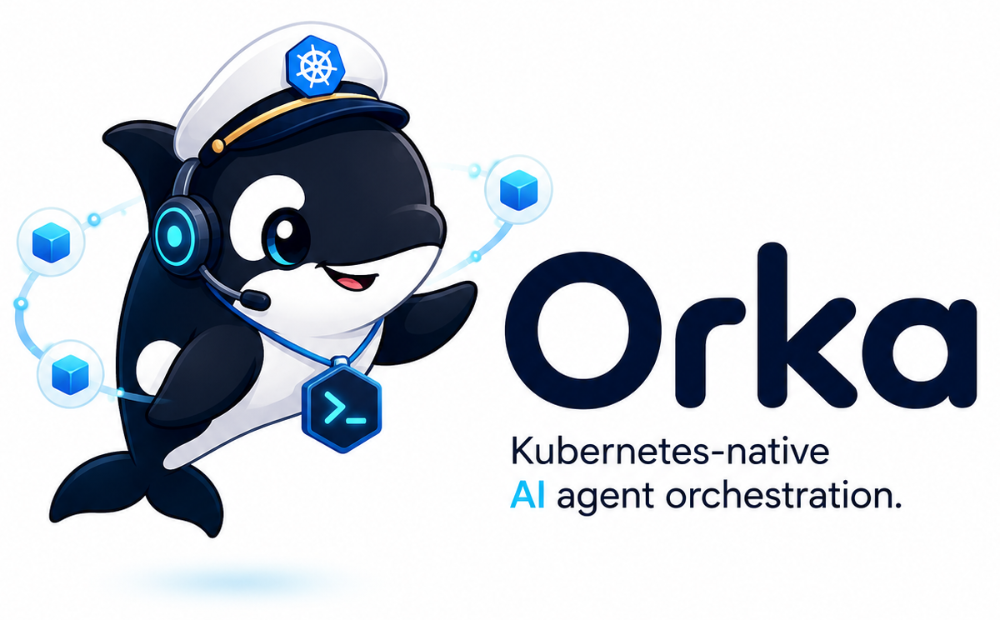

<div align="center">



# Orka

**Run AI agents on your Kubernetes cluster. The keys stay in the cluster.**

[](https://github.com/orka-agents/orka/actions/workflows/test.yml)
[](https://github.com/orka-agents/orka/releases)
[](LICENSE)

[Getting started](https://orka-agents.github.io/orka/docs/getting-started) · [Install](https://orka-agents.github.io/orka/docs/installation) · [Docs](https://orka-agents.github.io/orka/) · [Contributing](CONTRIBUTING.md)

</div>

---

Orka lets you hand a piece of work to an AI agent and get the result back, with
Kubernetes doing what it is good at: running the work somewhere isolated, keeping a
record of what happened, and cleaning up afterwards. You write a small YAML **Task**,
Orka runs it in a Pod, and you read the answer from a REST API, a CLI, or the dashboard
that comes built in.

Three kinds of work fit in a Task:

- **Ask a model.** Orka's own AI worker talks to Anthropic, OpenAI, Azure OpenAI, or any
  compatible endpoint, with built-in tools such as web search and code execution.
- **Run a coding agent.** Codex, Claude Code, GitHub Copilot CLI, or OpenCode, working on
  a real git repository and opening the pull request when it is done.
- **Run a command.** Any container image, for the build and test steps agents ask for.

Model keys never leave the cluster. People and CI get a token; the platform team decides
which models and providers are allowed.

> [!IMPORTANT]
> **Orka is experimental and under active development.** APIs, CRDs, and behavior may change without notice between releases, and it is not yet recommended for production use. Feedback, bug reports, and feature ideas are very welcome — please [open an issue](https://github.com/orka-agents/orka/issues).

> [!NOTE]
> The organization and repositories are intended to be donated to a community-governed foundation at the appropriate time. Until then, the project is governed by Microsoft policy, and external contributors are required to sign the Microsoft Contributor License Agreement (CLA).

## Try it in five minutes

You need a cluster, `kubectl`, and Helm. A local [kind](https://kind.sigs.k8s.io/) cluster
is fine. No model API key yet.

```bash
helm repo add orka https://orka-agents.github.io/orka/charts
helm repo update orka
helm install orka orka/orka --namespace orka-system --create-namespace --wait --timeout 10m
```

That is the whole install. Now run something:

```bash
kubectl -n orka-system apply -f - <<'EOF'
apiVersion: core.orka.ai/v1alpha1
kind: Task
metadata:
  name: hello
spec:
  type: container
  command: ["sh", "-c", "echo hello from orka"]
EOF
kubectl -n orka-system get task hello --watch
```

When the phase reads `Succeeded`, Orka has run its first Task for you. From here,
[Getting started](https://orka-agents.github.io/orka/docs/getting-started) walks through
connecting to the API, adding a model, and running your first AI Task and your first
coding agent.

## What people build with it

- **[Pull request review on every PR.](https://orka-agents.github.io/orka/docs/repository-monitors)**
  A repository monitor queues review Tasks as PRs arrive and posts the findings back.
- **["Just do it" chat.](https://orka-agents.github.io/orka/docs/chat)** Describe what
  you want in plain language and an orchestrator creates and runs the Tasks, in the
  dashboard or over the API.
- **[Agents on a schedule.](https://orka-agents.github.io/orka/docs/scheduled-tasks)**
  Nightly dependency audits, security scans, or reports, with retries and notifications
  handled for you.
- **[Your existing tools, safer.](https://orka-agents.github.io/orka/docs/openai-compat)**
  Point Cursor, Continue, or Claude Code at Orka's OpenAI- and Anthropic-compatible
  endpoints and stop handing out provider keys.

## Why on Kubernetes

- **No keys on laptops.** Provider credentials live in Secrets; people and CI get scoped tokens.
- **One place to govern.** Models, providers, tools, and limits are set per Agent and per namespace.
- **Everything is a record.** Tasks, sessions, artifacts, and the pull requests agents open are durable and auditable.
- **Scale with the cluster.** Scheduling, retries, concurrency, and cron come from the control plane you already run.

## Learn more

- [Architecture](https://orka-agents.github.io/orka/docs/architecture) — how a Task becomes a Pod
- [Interactive chat](https://orka-agents.github.io/orka/docs/chat) — the orchestrator and its tools
- [Coding agents](https://orka-agents.github.io/orka/docs/agent-runtimes) — Codex, Claude Code, Copilot, and OpenCode as pooled runtimes
- [Compatibility APIs](https://orka-agents.github.io/orka/docs/openai-compat) — using Orka from your editor
- [Security](https://orka-agents.github.io/orka/docs/security) — the trust model and hardening
- [Troubleshooting](https://orka-agents.github.io/orka/docs/troubleshooting) — error strings, causes, fixes
- [Development](https://orka-agents.github.io/orka/docs/development) — building and testing Orka itself

## Join in

Questions, bug reports, and ideas are welcome in
[issues](https://github.com/orka-agents/orka/issues). If you want to contribute code,
[CONTRIBUTING.md](CONTRIBUTING.md) has the setup and the review process, and
[SECURITY.md](SECURITY.md) explains how to report a vulnerability privately.

## License

[MIT](LICENSE)
