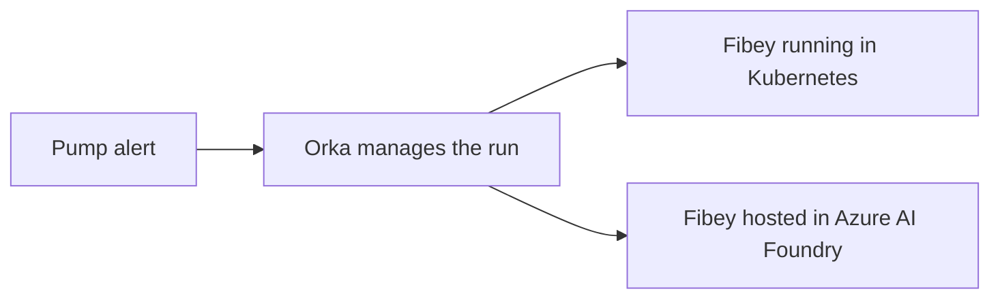

# Run Fibey with Orka, AgentKit, and Azure AI Foundry

Fibey is an example assistant for investigating equipment alerts. In this demo,
it reviews a fictional pump incident and suggests what to check next.

AgentKit packages Fibey's instructions and model settings. You can run that
agent in Kubernetes or host it in Azure AI Foundry. Orka sends the request and
tracks the run in both cases. You'll try both options and compare the answers.



Both options use harness v2, Orka's interface for managing agent runs. This
example analyzes the text in the request. It does not use tools or operate
real equipment.

## Before you start

This walkthrough assumes both Fibey services are already deployed and connected
to Orka. If you're setting them up, start with the [setup guide](build-images.md).

You'll need:

- Access to a Kubernetes cluster with Orka running in harness v2 mode.
- `kubectl` to communicate with the cluster and `jq`, which the demo script uses.
- The [`orka` command-line tool](../../website/docs/reference/cli.md), which reads Fibey's answers.
  Follow its [connection and authentication steps](../../website/docs/reference/cli.md#connection-and-authentication)
  to connect to the same Orka installation before running the demo.
- The following two services registered with Orka and marked `Ready`.

| Run option | Where Fibey runs | Name registered with Orka |
| --- | --- | --- |
| `agentkit` | Kubernetes | `fibey-agentkit-runtime` |
| `foundry` | Azure AI Foundry | `fibey-foundry-runtime` |

Orka calls each registered connection an `AgentRuntime`. The setup guide covers
creating these connections and configuring their credentials.

## 1. Connect the demo

Run these commands from the root of your Orka checkout. Replace the example
values with your cluster context, namespace, and Orka server address.
A context selects your cluster connection; a namespace groups resources within
that cluster. The server address must point to Orka in that same cluster.

```bash
set -euo pipefail
FIBEY_CONTEXT=your-cluster-context
FIBEY_NAMESPACE=your-orka-namespace
FIBEY_SERVER=https://orka.example.com

kubectl --context="$FIBEY_CONTEXT" -n "$FIBEY_NAMESPACE" apply \
  -k examples/fibey-custom-agent-demo
```

This adds two Orka `Agent` entries, one for each hosting option. Each entry
points to a service prepared during setup. Keep using the same terminal for
the remaining steps.

## 2. Run Fibey with both options

Each command below creates a `Task`, Orka's record of one run. Both use the same
request from [task.yaml](task.yaml): a pressure sensor reports a sudden drop
after maintenance, while the other readings look normal.

The last argument is the Task name. Choose a new name each time you run either
command again.

```bash
examples/fibey-custom-agent-demo/switch-backend.sh \
  agentkit "$FIBEY_CONTEXT" "$FIBEY_NAMESPACE" fibey-quincy-agentkit-01

examples/fibey-custom-agent-demo/switch-backend.sh \
  foundry "$FIBEY_CONTEXT" "$FIBEY_NAMESPACE" fibey-quincy-foundry-01
```

On success, the script confirms that Orka assigned the Task to your chosen
service. Fibey may still be preparing its answer.

## 3. Read and compare the answers

Wait for both runs to finish. If you chose different Task names above, use
those names here too.

```bash
kubectl --context="$FIBEY_CONTEXT" -n "$FIBEY_NAMESPACE" wait \
  --for=jsonpath='{.status.phase}'=Succeeded \
  task/fibey-quincy-agentkit-01 task/fibey-quincy-foundry-01 --timeout=360s
```

When the wait command succeeds, fetch the Kubernetes answer, then the Foundry
answer. Each command prints the answer as text:

```bash
orka --server "$FIBEY_SERVER" -n "$FIBEY_NAMESPACE" \
  task result fibey-quincy-agentkit-01

orka --server "$FIBEY_SERVER" -n "$FIBEY_NAMESPACE" \
  task result fibey-quincy-foundry-01
```

Look for an answer that uses the supplied evidence, identifies missing checks,
and explains what is still uncertain. The wording can differ between runs.

If a result command reports an authentication error, check the CLI's configured
credentials and server address. If it reports that no result is available,
inspect the existing Task as described below.

## If a run does not finish

If submission or waiting fails, inspect that Task before starting another run.
A submission error can still leave a Task running. For example, to inspect the
Kubernetes run:

```bash
kubectl --context="$FIBEY_CONTEXT" -n "$FIBEY_NAMESPACE" get \
  task/fibey-quincy-agentkit-01 -o yaml
```

Use the name of the run that needs attention. If you see `OutcomeUnknown`, Orka
cannot yet confirm the outcome of the remote work. Do not resubmit or delete
that Task. Keep its supporting services running and follow the setup guide's
[troubleshooting instructions](build-images.md#troubleshoot-a-run).

## Clean up

After both runs succeed, delete the two Tasks you created, using the names you
chose earlier. Keep the agent services running while Orka finishes the cleanup.

```bash
kubectl --context="$FIBEY_CONTEXT" -n "$FIBEY_NAMESPACE" delete \
  task/fibey-quincy-agentkit-01 task/fibey-quincy-foundry-01 --wait=true --timeout=180s
```

This walkthrough covers one request per run. Tool use, follow-up messages, and
recovery from interrupted remote work need separate testing. See the setup
guide for [demo settings and limits](build-images.md#demo-settings-and-limits)
and [checks you can run without a deployed agent](build-images.md#check-the-example-locally).
